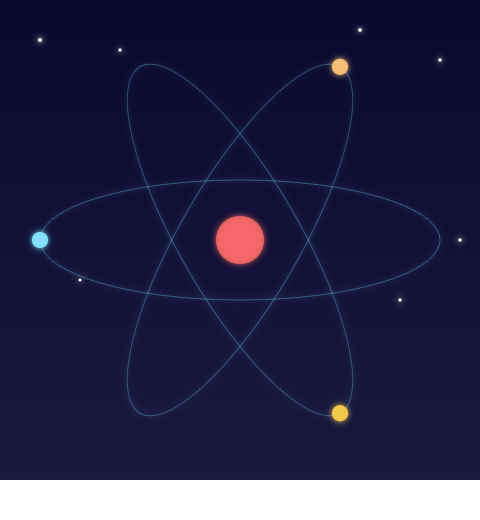

# Atomic Night Theme

Atomic Night is a sleek dark theme designed for the Zed code editor. Inspired by a night sky, this theme offers a visually pleasing experience for developers, enhancing readability and reducing eye strain.

## Example

**JavaScript Example:**

**Golang Example:**

**Python Example:**

## Installation

To use the Atomic Night theme, simply add the theme JSON file to your Zed themes directory.

## Customization

Feel free to modify the colors and styles to suit your preferences. Contributions are welcome! # atomic-night
